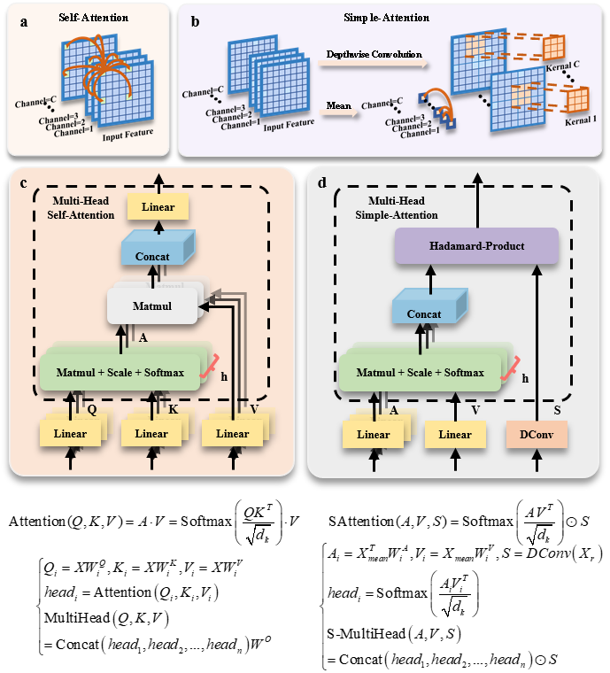
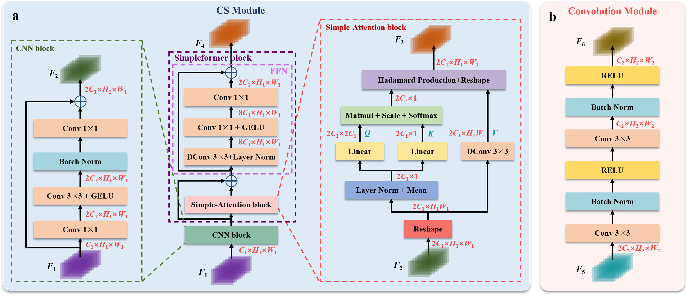
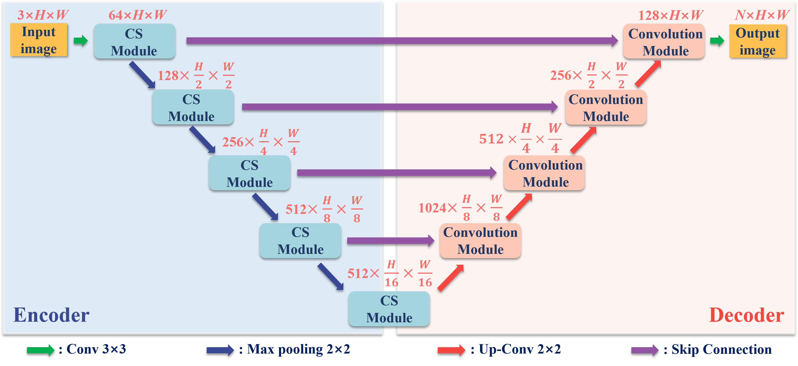

# Simple-Attention
This is the code base for **`"CS-Net: Conv-Simpleformer Network for agricultural image segmentation"`**

## Abstract
The agricultural industry faces numerous challenges, including incomplete sensor networks, long image acquisition cycles, and poor image quality, resulting in limited prediction accuracy and inadequate generality of conventional semantic segmentation models. 

To address this, we propose Conv-Simpleformer Network (CS-Net), which fuses CNN and Transformer. **`A lightweight Simple-Attention Block (SIAB) is designed to solve the problem of quadratic correlation between the computational complexity of Self-Attention and image size`**. **`SIAB uses channel-by-channel and spatial convolution computation, and its computational complexity is linearly related to image size`**. 

Additionally, this study cascades an FFN after SIAB to form a Simpleformer block, enhancing its spatial modeling capability. 

Finally, we performed comparison and ablation experiments on agricultural image datasets. The experimental results showcase CS-Net's superiority over other control models across various agricultural image segmentation tasks. The cascaded CNN and Simpleformer blocks effectively harness SIAB's potential to extract deep features and uncover hidden connections between targets.

## Design of the Proposed *Simple-Attention Block(SIAB)*
Although self-attention block(SEAB) effectively encodes spatial information and extracts global information, the similarity score matrix A has a shape of *NxN*, which causes the **computational complexity of SEAB to grow quadratically with the increase in input image size**.

**Element-by-element computation in SEAB is redundant**, so we design an efficient and lightweight attention block called Simple-Attention Block (SIAB). **SIAB converts the `element-by-element calculation` operation of SEAB into `channel-by-channel and spatial convolution calculations`**

**SIAB effectively solves the problem that the computational complexity of SEAB increases quadratically with the size of the input image**. In semantic segmentation tasks, the input image size is usually relatively large. Suppose the size of the input image is [Ci, Hi, Wi] = [3, 512, 512], kH=kW=3, and the input features of the third CS Module in the CS-Net encoder are [C, H, W] = [256, 128, 128]. The computational complexity *OmigaSIAB* of SIAB is **0.42 G**, and the computational complexity *OmigaSEAB* of SEAB is **141.73 G**. *OmigaSEAB* is **337.5 times larger** than *OmigaSIAB*, so **SIAB significantly reduces the demand for computational resources**.

## Design of the Proposed *Conv-Simpleformer Network(CS-Net)*
Referring to the design idea of the classical Transformer module, to enhance the modeling ability of the location information of the target to be detected and to enrich the feature representation ability, the FFN is cascaded after the SIAB to form a Simpleformer block.

The overall architecture of CS-Net, is in the shape of a letter "V" and consists of two parts: an encoder and a decoder, which generate segmentation results end-to-end.

CS-Net extracts the global representation and local features of the input image and retains the detailed features of the image through the combination of encoder and decoder, thus improving the accuracy and efficiency of image segmentation.

## Results
**To learn more detail please read our paper**.

The quantitative comparison between models that have been applied more frequently in agricultural semantic segmentation and the proposed model.
| Test  | Model | Input size | #params | FLOPs | MIoU | PA |
| :---: | :---: | :---: | :---: | :---: | :---: | :---: |
| Scenario 1 | U-Net | 512×512 | **13.4M** | **124.5G** | 88.7% | 97.9% |
| Scenario 1 | DeepLab v3+ | 512×512 | 14.8M | 295.9G | 88.9% | 97.8% | 
| Scenario 1 | SegNet | 512×512 | 31.9M | 174.9G | 83.8% | 96.5% | 
| Scenario 1 | CS-Net | 512×512 | **17.9M** | **157.1G** | **89.7%** | **898.1%** | 
| Scenario 2| U-Net | 800×600 | **13.4M** | **227.9G** | 83.7% | 99.0% |
| Scenario 2 | DeepLab v3+ | 800×600 | 14.8M | 541.4G | 83.9% | 99.1% | 
| Scenario 2 | SegNet | 800×600 | 31.9M | 318.8G | 80.4% | 98.8% | 
| Scenario 2 | CS-Net | 800×600 | 17.9M | 287.5G | **84.2%** | **99.2%** | 
| Scenario 3 | U-Net | 672×376 | **13.4M** | **119.9G** | 84.2% | 97.5% |
| Scenario 3 | DeepLab v3+ | 672×376 | 14.8M | 284.9G | 86.0% | 98.3% | 
| Scenario 3 | SegNet | 672×376 | 31.9M | 167.4G | 78.9% | 96.9% | 
| Scenario 3 | CS-Net | 672×376 | 17.9M | 151.3G | **88.7%** | **98.4%** | 

The results of the ablation experiments.
| Experiment | Input size | Number head | #params | FLOPs | MIoU | PA |
| :---: | :---: | :---: | :---: | :---: | :---: | :---: |
| Baseline+CNN | 512×512 | - | 13.4M | 124.5G | 88.7% | 97.9% |
| Scenario 1 | 512×512 | 2 | **11.8M** | **111.4G** | 88.0% | 97.3% | 
| Scenario 1 | 512×512 | 2 | 13.6M | 129.3G | 34.6% | 74.9% | 
| Scenario 1 | 512×512 | 2 | 19.7M | 175.1G | 49.9% | 81.7% | 
| Scenario 2| 512×512 | 2 | 17.9M | 157.1G | **89.7%** | **98.1%** |

The results of semantic segmentation.

Visualization of the model output at different stages in the ablation experiment.

## Requirements
- The code has been written in Python (3.9.16) and requires pyTorch (version 2.0.1)
- Install the dependencies using pip install -r requirements.txt

## Preparing your data
You have to split your data into three folders: train/val/test. Each folder will contain two sub-folders: Img and GT, which contain the png files for the images and their corresponding ground truths. The naming of these images is important, as the code to save the results temporarily to compute the 3D DSC, for example, is sensitive to their names.
