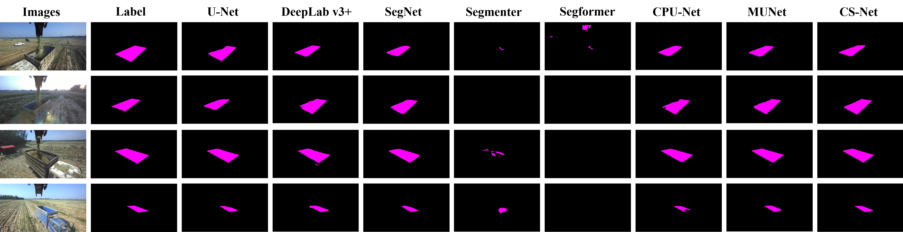

# Simple-Attention
This is the code base for **`"CS-Net: Conv-Simpleformer Network for agricultural image segmentation"`**

## Abstract
Incomplete sensor networks and long image acquisition cycles in agriculture cause inferior quality of agricultural datasets, limiting traditional Transformer models' effectiveness. 

Therefore, we propose the **`Conv-Simpleformer Network (CS-Net)`** combining CNN and Simpleformer. 

Then, we devise a lightweight **`Simple-Attention Block (SIAB)`** `to address the quadratic correlation between Self-Attention's computational complexity and image size`. SIAB encompasses channel-by-channel and spatial computation branches, with **`computational complexity linearly linked to image size`**. 

Further, `cascading FFN and SIAB forms a Simpleformer that weakens the attention bias of SIAB`. 

In addition, **`the introduction of CNN motivates SIAB to learn the abstract hidden-layer connections of the target's high dimensionality`**, **`which reduces the dependence of Transformers on the datasets`**.

Finally, we conduct comparison and ablation experiments on agricultural image datasets, and the results show that CS-Net has `the best performance and strikes a good balance between model complexity, computational efficiency, and performance`.

## Design of the Proposed *Simple-Attention Block(SIAB)*
Although self-attention block(SEAB) effectively encodes spatial information and extracts global information, the similarity score matrix A has a shape of *NxN*, which causes the **computational complexity of SEAB to grow quadratically with the increase in input image size**.

**Element-by-element computation in SEAB is redundant**, so we design an efficient and lightweight attention block called Simple-Attention Block (SIAB). **SIAB converts the element-by-element computation operation of SEAB into `channel-by-channel and spatial computation branches`**.

**SIAB effectively solves the problem that the computational complexity of SEAB increases quadratically with the size of the input image**. In semantic segmentation tasks, the input image size is usually relatively large. Suppose the size of the input image is [Ci, Hi, Wi] = [3, 512, 512], kH=kW=3, and the input features of the third CS Module in the CS-Net encoder are [C, H, W] = [256, 128, 128]. The computational complexity *OmigaSIAB* of SIAB is **0.42 G**, and the computational complexity *OmigaSEAB* of SEAB is **141.73 G**. *OmigaSEAB* is **337.5 times larger** than *OmigaSIAB*, so **SIAB significantly reduces the demand for computational resources**.


## Design of the Proposed *Conv-Simpleformer Network(CS-Net)*
Referring to the design idea of the classical Transformer module, to enhance the modeling ability of the location information of the target to be detected and to enrich the feature representation ability, the FFN is cascaded after the SIAB to form a Simpleformer block. Furthermore, we design a CS module by cascading CNN with Simpleformer.

The overall architecture of CS-Net, is in the shape of a letter "V" and consists of two parts: an encoder and a decoder, which generate segmentation results end-to-end.

CS-Net extracts the global representation and local features of the input image and retains the detailed features of the image through the combination of encoder and decoder, thus improving the accuracy and efficiency of image segmentation.


## Results
**To learn more detail please read our paper**.
### Comparison experiments
The quantitative comparison between models that have been applied more frequently in agricultural semantic segmentation and the proposed model.


Segmentation results for all models in scenario 1. Throughput was obtained on RTX 4090 GPU.
| Test  | Model | Input size | #params(M) | FLOPs(G) |  Throughput(Image/s) | Memory usage(M) | MIoU | PA |
| :---: | :---: | :---: | :---: | :---: | :---: | :---: |  :---: | :---: |
| Scenario 1 | U-Net | 512×512 | **13.4M** | **124.5G** | 156.02 | 34428 | 88.7% | 97.9% |
| Scenario 1 | DeepLab v3+ | 512×512 | 14.8M | 295.9G | 135.60 | 34385 | 88.9% | 97.8% | 
| Scenario 1 | SegNet | 512×512 | 31.9M | 174.9G | 143.61 | 34405 | 83.8% | 96.5% | 
| Scenario 1 | Segmenter | 512×512 | 25.0 | 409.4 | 0.37 | 37219 | 17.9% | 71.6% | 
| Scenario 1 | Segformer | 512×512 | 18.5 | 173.1 | 0.08 | 34058 | 42.7% | 80.4% | 
| Scenario 1 | CPU-Net | 512×512 | 21.8 | 132.1 | 72.63 | 34514 | 82.5% | 95.1% | 
| Scenario 1 | MUNet | 512×512 | 14.2M | 210.4 | 89.13 | 34313 | 88.5% | 97.7% | 
| Scenario 1 | CS-Net | 512×512 | 17.9M | 157.1G | 123.14 | 5017 | **89.7%** | **98.1%** | 


Segmentation results for all models in scenario 2.
| Test  | Model | Input size | #params(M) | FLOPs(G) |  Throughput(Image/s) | Memory usage(M) | MIoU | PA |
| :---: | :---: | :---: | :---: | :---: | :---: | :---: |  :---: | :---: |
| Scenario 2| U-Net | 800×600 | **13.4M** | **227.9G** | 30.72 | 35231 | 83.7% | 99.0% |
| Scenario 2 | DeepLab v3+ | 800×600 | 14.8M | 541.4G | 39.24 | 35136 | 83.9% | 99.1% | 
| Scenario 2 | SegNet | 800×600 | 31.9M | 318.8G | 28.7 | 35112 | 80.4% | 98.8% | 
| Scenario 2 | Segmenter | 512×512 | 25.0 | 409.4 | 1.39 | 37215 | 48.7% | 97.5% | 
| Scenario 2 | Segformer | 512×512 | 18.5 | 173.1 | 0.06 | 34403 | 66.8% | 97.8% | 
| Scenario 2 | CPU-Net | 800×600 | 21.8 | 241.5 | 10.72 | 35264 | 83.0% | 98.9% | 
| Scenario 2 | MUNet | 800×600 | 14.2M | 385.1 | 14.31 | 35063 | 41.9% | 99.1% | 
| Scenario 2 | CS-Net | 800×600 | 17.9M | 287.5G | 21.24 | 9011 | **84.2%** | **99.2%** | 


Segmentation results for all models in scenario 3.
| Test  | Model | Input size | #params(M) | FLOPs(G) |  Throughput(Image/s) | Memory usage(M) | MIoU | PA |
| :---: | :---: | :---: | :---: | :---: | :---: | :---: |  :---: | :---: |
| Scenario 3 | U-Net | 672×376 | **13.4M** | **119.9G** | 169.31 | 34394 | 84.2% | 97.5% |
| Scenario 3 | DeepLab v3+ | 672×376 | 14.8M | 284.9G | 140.80 | 34352 | 86.0% | 98.3% | 
| Scenario 3 | SegNet | 672×376 | 31.9M | 167.4G | 142.70 | 34425 | 78.9% | 96.9% | 
| Scenario 3 | Segmenter | 672×376 | 25.0 | 394.6 | 5.11 | 34860 | 47.2% | 94.4% | 
| Scenario 3 | Segformer | 512×512 | 18.5 | 173.0 | 0.03 | 34058 | 48.5% | 94.6% | 
| Scenario 3 | CPU-Net | 672×376 | 21.8 | 127.0 | 74.47 | 34480 | 77.6% | 96.9% | 
| Scenario 3 | MUNet | 672×376 | 14.2 | 202.7 | 88.41 | 34279 | 86.0% | 97.8% | 
| Scenario 3 | CS-Net | 672×376 | 17.9M | 151.3G | 145.35 | 4840 | **88.7%** | **98.4%** | 




Segmentation results for all models in scenario 4.
| Test  | Model | Input size | #params(M) | FLOPs(G) |  Throughput(Image/s) | Memory usage(M) | MIoU | PA |
| :---: | :---: | :---: | :---: | :---: | :---: | :---: |  :---: | :---: |
| Scenario 4 | U-Net | 512×512 | **13.4M** | **124.5G** | 153.70 | 34426 | 76.1% | 91.3% |
| Scenario 4 | DeepLab v3+ | 512×512 | 14.8M | 295.9G | 139.24 | 34384 | 75.8% | 91.4% | 
| Scenario 4 | SegNet | 512×512 | 31.9M | 174.9G | 142.25 | 34403 | 74.8% | 91.5% | 
| Scenario 4 | Segmenter | 512×512 | 25.0 | 409.4 | 4.57 | 37215 | 41.8% | 83.5% | 
| Scenario 4 | Segformer | 512×512 | 18.5 | 173.1 | 0.08 | 34058 | 57.0% | 83.5% | 
| Scenario 4 | CPU-Net | 512×512 | 21.8 | 132.1 | 72.39 | 34512 | 72.9% | 89.9% | 
| Scenario 4 | MUNet | 512×512 | 14.2M | 210.4 | 87.66 | 34311 | 75.4% | 89.9% | 
| Scenario 4 | CS-Net | 512×512 | 17.9M | 157.1G | 124.71 | 5015 | **81.4%** | **93.9%** | 


### Cross-dataset evaluation
**To learn more detail please read our paper**.

Cross-datasets evaluation results for all control models in scenario 4.

| Model | Input size | MIoU | PA |
| :---: | :---: | :---: | :---: |
| U-Net | 512×512 | 76.2% | 95.1% |
| DeepLab v3+ | 512×512 | 75.2% | 94.8% | 
| SegNet | 512×512 | 75.4% | 95.9% | 
| Segmenter | 512×512 | 44.9% | 89.8% | 
| Segformer | 512×512 | 67.5% | 89.9% | 
| CPU-Net | 512×512 | 57.3% | 91.7% | 
| MUNet | 512×512 | 76.3% | 95.6% | 
| CS-Net | 512×512 | **79.3%** | **96.5%** | 


### Detail experiments
**To learn more detail please read our paper**.

The quantitative results of detail experiments.

| Model | Weight Strategy | MIoU |
| :---: | :---: | :---: | 
| Baseline 1 | No layernorm | 88.3% | 
| Model 1-1 | Add LayerNorm to the spatial computation branch | 87.2% | 
| Model 1-2 | Add LayerNorm to the channel-by-channel computation branch | 89.4% |
| Model 1-3 | Add LayerNorm to two branches | 89.7% | 


The results of the ablation experiments.
| Experiment | Input size | Number head | #params | FLOPs | MIoU | PA |
| :---: | :---: | :---: | :---: | :---: | :---: | :---: |
| Baseline+CNN | 512×512 | - | 13.4M | 124.5G | 88.7% | 97.9% |
| Baseline+SEAB | 512×512 | 2 | 13.6M | 129.3G | 34.6% | 74.9% | 
| Baseline+SIAB | 512×512 | 2 |**11.8M** | **111.4G** | 88.0% | 97.3% | 
| Baseline+CNN+SEAB | 512×512 | 2 | 19.7M | 175.1G | 49.9% | 81.7% | 
| Baseline+CNN+SIAB | 512×512 | 2 | 17.9M | 157.1G | **89.7%** | **98.1%** |

The results of semantic segmentation.


Visualization of the model output at different stages in the ablation experiment.


## Requirements
- The code has been written in Python (3.9.16) and requires pyTorch (version 2.0.1)
- Install the dependencies using pip.
- argparse \ numpy \ pillow \ opencv-python \ torchsummary \ pathlib \ matplotlib \ tensorboardX \ thop

## Preparing your data
You have to split your data into three folders: train/val/test. Each folder will contain two sub-folders: images and masks, which contain the png files for the images and their corresponding ground truths. The default working path of this project is "Data\aug\".

## Train CS-Net for your dataset in windows
To train a CS-Net on your dataset from scratch, run: train.py

## Train CS-Net for your dataset in Linux
To train a CS-Net on your dataset from scratch, run: 

```bash
python -m torch.distributed.launch --nproc_per_node=1 train_linux.py
```
Note that main_linux.py only supports single-machine, single-card training.

## Citation
